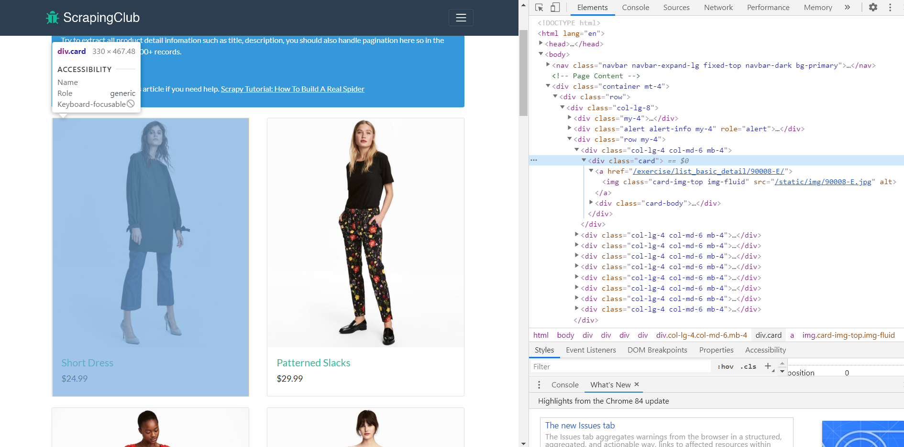
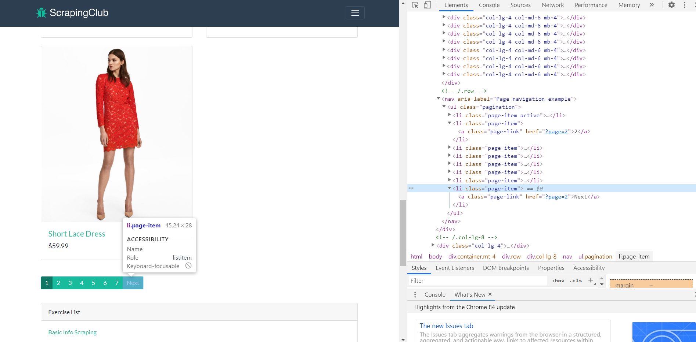
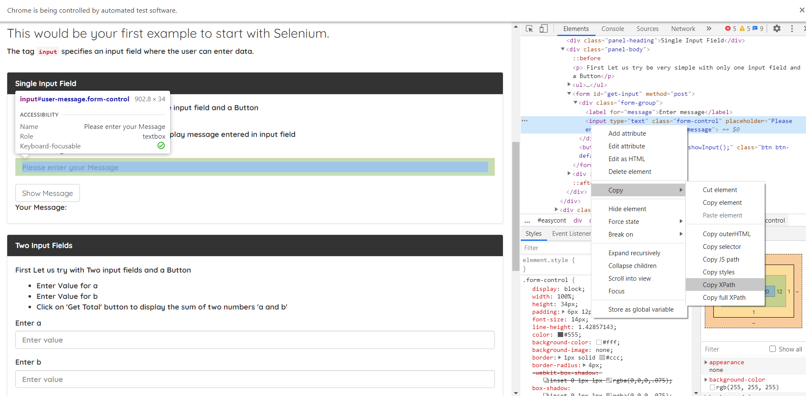
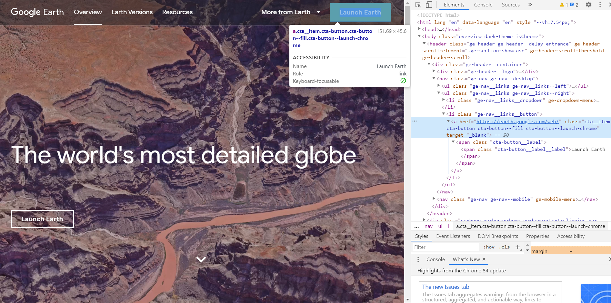
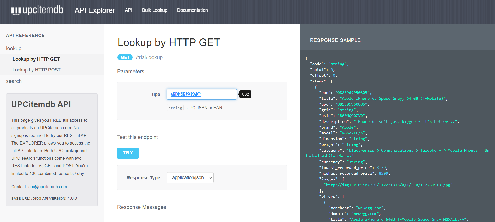
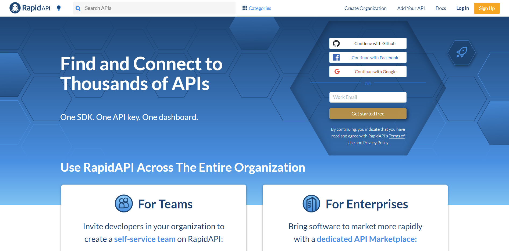

# Web Scraping Fundamentals
This repository introduces the fundamental cencepts of web scraping and practices using different web-scraping packages in Python. It also includes a brief introduction of API request for data collection.

## Section 1: Web Scraping Basics
1. Request and Parsing
2. Explore HTML Structure
3. Isolate Data
4. Preparing for Paginated Scraping
5. Scraping Paginated Content

## Section 2: Auotmate Web Browsing with Selenium
1. Automating Web Browsing
2. Basic Browser Interactions
3. Handling Drag and Drop
4. Selenum Implicit Wait Functions
5. Selenum Explicit Wait Functions

## Section 3: Automating with APIs
1. Create API Requests
2. Parsing through JSON
3. Using API Keys
4. Linking API Calls

### Resources:  

[Selenium](https://selenium-python.readthedocs.io/)  |  [Quotes to Scrape](http://quotes.toscrape.com/)  |  [Scraping Club](https://scrapingclub.com/)  |  [ChromeDriver](https://chromedriver.chromium.org)  |  [GeckoDriver](https://github.com/mozilla/geckodriver)  |  [Rapid API](https://rapidapi.com/)
 
 
Copyright © 2020 Norman Lo
